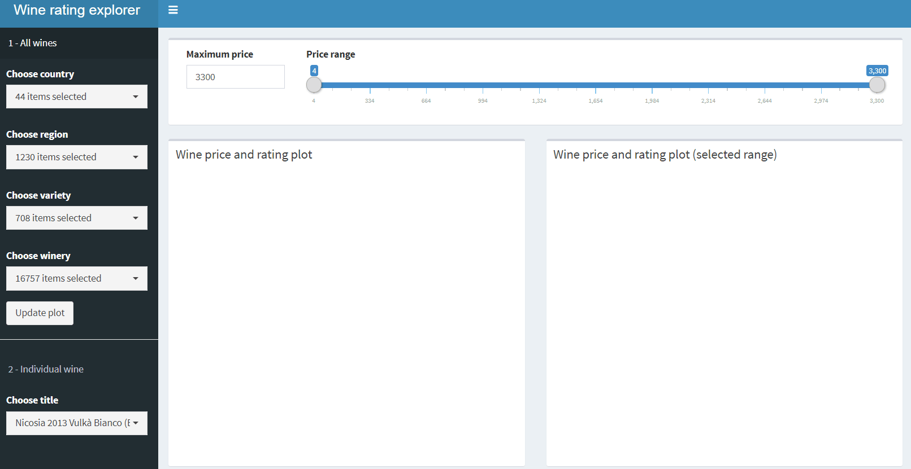
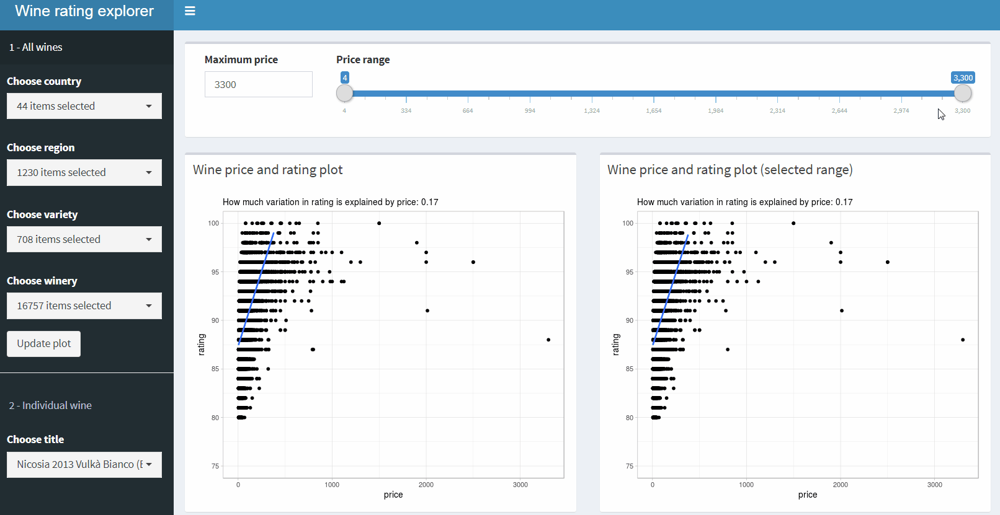

# Wine rating explorer

\#tidytuesday 05/28/2019

## Click "Update plot" when app first loaded, and whenever filters change. 

The dataset is quite large so can take ~15 seconds for the app to initiate. The reactive actions and calculations are quite straightforward, so I assume it was the size of the data that slows it down. Please let me know if you know a way to make it faster. 

## Price - rating plots

The left plot includes all wines with prices below "Maximum price". I added the maximum price option so users can remove the super rare and expensive wines and focus on wines in a more normal price range. I didn't transform the long-tail price variable since it makes more intuitive sense to wine lovers on original scale. 

The right plot reactives to the slider on the top of the page, as well as all the filters on sidebar. More to come. 

Click on data points to see detailed information. I've been borrowing code from [this](https://gitlab.com/snippets/16220) wonderful example when creating hover/click info on ggplots. It works perfectly when click/hover is the only interactivity you want so don't have to slow the whole thing down like crazy with plotly. The only thing I changed is the coordonates of the wellpane. In the original example, the wellpane gets squeezed or even off screen when the data point you click on is very close to the right or bottom edge. In this implementation, the wellpane can be on both left or right of the data point, thus there are less weirdly squashed wellpanes. 

