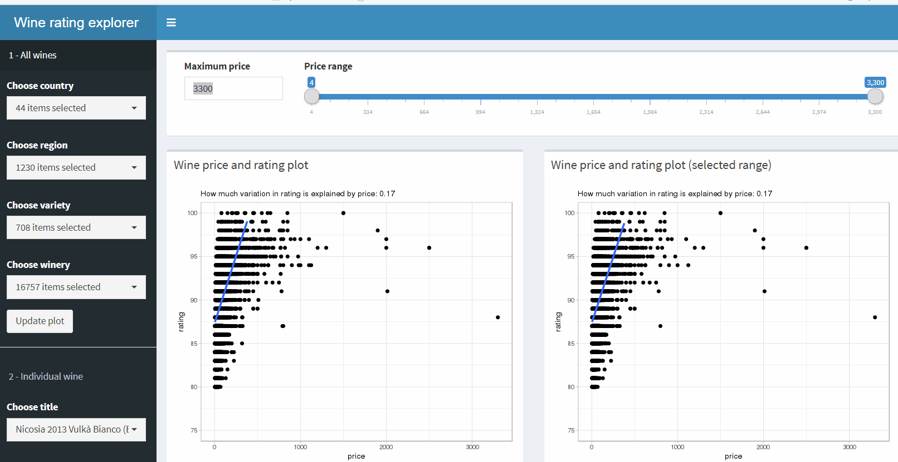
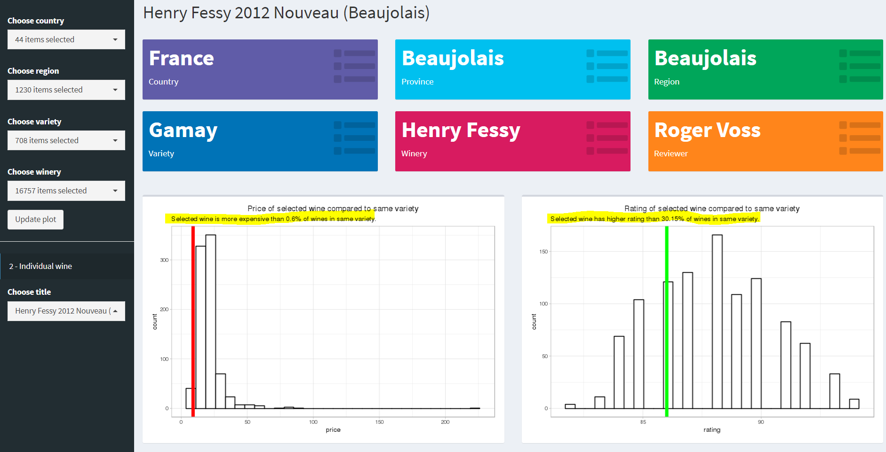

# Wine rating explorer

\#tidytuesday 05/28/2019

## 1. Click "Update plot" when app first loaded, and whenever filters change. 

The dataset is quite large so can take ~15 seconds for the app to initiate. The reactive actions and calculations are quite straightforward, so I assume it was the size of the data that slows it down. Please let me know if you know a way to make it faster. 

## 2. Price - rating plots

The left plot includes all wines with prices below "Maximum price". I added the maximum price option so users can remove the super rare and expensive wines and focus on wines in a more normal price range. I didn't transform the long-tail price variable since it makes more intuitive sense to wine lovers on original scale. 

The right plot reactives to the slider on the top of the page, as well as all the filters on sidebar. More to come. 

Click on data points to see detailed information. I've been borrowing code from [this](https://gitlab.com/snippets/16220) wonderful example when creating hover/click info on ggplots. It works perfectly when click/hover is the only interactivity you want so don't have to slow the whole thing down like crazy with plotly. The only thing I changed is the coordinates of the wellpane. In the original example, the wellpane gets squeezed or even off screen when the data point you click on is very close to the right or bottom edge. In this implementation, the wellpane can be on both left or right of the data point, thus there are less weirdly squashed wellpanes. 

## 3. Price range

The price range slider controls which subset to plot on the right plot. Remember you can drag the interval along the slider. I found it funny that for wines that cost less than \$200, the correlation seems positive, yet for wines that cost more than \$200 up tp at least \$1000, it gets pretty close to 0 or even negative ...

The price range plotted in the right plot is shaded in the left plot. 

## 4. Filters 

I used the great [`shinyWidgets`](https://github.com/dreamRs/shinyWidgets) package to add filters (`pickerInput`) for the professional look and ease of use (select/deselect all, search, count of items seleted, etc.).

### 4.1 Select/deselect all, select/deselect 

### 4.2 Search and select/deselect all

Here, I only want to include wines produced in the Napa valley. Thus I first deselect all, search key word "napa", and select all search results. You can do the same and add all wined from Bordeaux etc. 

### 4.3 Search and select/deselect

Of course, you can search and select/deselect single wines.

## 5. Individual wine tab

On a second tab "Individual wine", users can look at more information on each wine in the dataset. Choose a wine (again with all the niceties of `pickerInput`), and the basic info are dislayed in value boxes ([`shinydashboard`](https://rstudio.github.io/shinydashboard/)). 

## 6. Selected wine compared to wines in same variety

Here I plotted two histograms of the price and ratings of wines in the same variety as the selected wine. The price and rating of the selected wine are marked with red and green vertical lines. The percentage of wines in the same variety that cost less and has lower ratings are calculated. 

Basically, you want to find wines that has a red bar close to the left (cheap) and a green bar close to the right (good). For example, the Henry Fessy 2012 Nouveau in the screenshot is practically the cheapest Gamay, while its rating beats 30% of Gamay, not a bad value!

## 7. To be added ... maybe

- I realized I don't have the actual price and rating of the individual wine tab. Maybe you can find it with the filters on the all wines tab and click on it ... you know, like a drinking game.

- Could be fun to calculated a score based on the two percentages on the individual wine tab and find the most economic wine in each variety/from each region, etc.

- Disclose: I'm not a wine person. If any part of the content doesn't make sense (e.g. maybe nobody really cares the province where the wine is produced), please let me know. Thanks.

